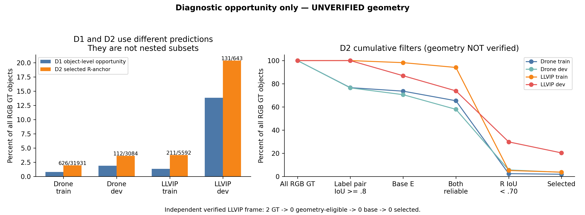

# Task-Conditional 阶段证据（2026-09-07 03:22 +08:00）

**独立实现和真实C路径验收已完成；L仍缺合格配准覆盖，未启动CL/CGT。按冻结计划的C归因分支，C-shuffled42已正式训练，C-same-modal42因内存预约阈值排队。整个三seed/四臂冲刺尚未完成。**

先读 [阶段执行验收](research_bundle/08_实验日志/2026-09-07_train_TaskConditional首轮/EXECUTION_REVIEW.md)、[冻结计划](research_bundle/08_实验日志/2026-09-07_train_TaskConditional首轮/EXPERIMENT_PLAN.md)、[D1/D2独立分析](research_bundle/08_实验日志/2026-09-07_probe_TaskConditional机会诊断/INDEPENDENT_RESULTS.md)。源码在 [独立模块](research_bundle/03_现行工程/SpaceNet6_OTD_official_reproduction/experiments/rgbir_task_conditional_v1)。

## 现有正式结果

| seed | N：同代码weight0 | C：OEv1 | C-random |
|---|---|---|---|
| 0 | E200，mAP54.346185 | 已完119 epoch | 已完47 epoch |
| 42 | E200，mAP54.513608 | E200，mAP54.658162 | 已完58 epoch |
| 123 | 已完114 epoch | E200，mAP54.636847 | 已完33 epoch |

仅4/9独立端点完整，只有seed42严格配对。**C42−N42为+0.144554 pp mAP50–95、−0.327243 pp AP75**。早期约+1pp参照不可用作正式增益。无新增CL、CGT或C内容对照AP；训练中的epoch不是评价结果。[03:20原始快照及v2分析](research_bundle/08_实验日志/2026-09-07_audit_RGBIR实施起点/snapshots/2026-09-07T032011.072078_0800/README.md)。

## 新诊断：机会与几何必须分开

| 数据集/划分 | 图数 | RGB GT | 实际anchor门控选中 | 选中/全部GT | 几何状态 |
|---|---:|---:|---:|---:|---|
| Drone train | 2048 | 31931 | 626 | 1.96% | 未核验，诊断假设 |
| Drone dev | 200 | 3084 | 112 | 3.63% | 未核验，诊断假设 |
| LLVIP train | 2048 | 5592 | 211 | 3.77% | 未核验，诊断假设 |
| LLVIP dev | 200 | 643 | 131 | 20.37% | 未核验，诊断假设 |
| LLVIP已接纳局部帧 | 1 | 2 | 0 | 0% | GT在覆盖区域之外 |

训练集机会明显小于LLVIP开发集，不能用20%预计训练信号。D2针对R预选anchor，不表示该对象没有其他好的预测，也不是当前动态学生检出但不准。所选教师GT-DFL CE平均优于R，但仍有少数更差；logit梯度余弦只是冻结R代理，不能证明训练避免了负迁移。

[几何审计](research_bundle/08_实验日志/2026-09-07_probe_TaskConditional几何审计/README.md)冻结300对名单，实际查看48对，只有LLVIP050001局部6个物理结构点通过独立复核。未覆盖不等于配准失败，但不允许进入L。**当前不准入L是证据限制，不是负训练结果。λL尚未校准，L/CL/CGT真实canary和E200均未执行。**

## 工程验收与在跑任务

N/C/C-shuffled/C-same-modal均完成24次成功optimizer更新，各记录6次初始AMP skip。新旧C/N在真实B32同图上的loss、native items、score/DFL梯度精确一致；真实loader及RNG等价通过。Shuffled全部30个canary批次的paired E/K/分母与C一致；same-modal只用RGB数据与独立RGB N0教师。

[C归因冻结与调度](research_bundle/08_实验日志/2026-09-07_train_OEv1内容归因/README.md)：C-shuffled42 E200已在GPU4启动；C-same-modal42在独立screen队列等待。其余五个旧训练继续。4张物理卡、每卡最多2个当前工程CUDA任务、剩3张空卡；因第二个新训练会使预约达到240GiB，guard主动排队。训练与独立last/EMA评价属于同一队列责任。

## 复核资产与边界

- [阶段小型原始回执、源码与模型路径快照](research_bundle/08_实验日志/2026-09-07_train_TaskConditional首轮/snapshots/stage_0322)；[canary完整压缩日志](research_bundle/08_实验日志/2026-09-07_train_TaskConditional首轮/large_canary_evidence_v1)。权重不上传。
- [D1/D2原始gzip、summary、receipt和复算脚本](research_bundle/08_实验日志/2026-09-07_probe_TaskConditional机会诊断)。15份gzip经解压原字节比较通过；仓库可直接用gzip复算。原JSONL留在工作区和94。
- [分析器接受范围](research_bundle/08_实验日志/2026-09-07_audit_RGBIR实施起点/ANALYZER_ACCEPTANCE.md)、[历史探针勘误](research_bundle/08_实验日志/2026-09-07_audit_RGBIR实施起点/PROBE_ERRATA.md)、[CMDistill/CCLKD partial审计](research_bundle/08_实验日志/2026-09-07_audit_RGBIR实施起点/COMPARATORS.md)。
- [本次导出清单](TASK_CONDITIONAL_BUNDLE_MANIFEST_20260907.json)。代码和数值证据保持原字节；仅导出Markdown链接适配。原始失败attempt保留。没有凭据、权重或数据集原图全集。

复核时不得把CPU测试当训练收益、把诊断假设当真实配准、把单seed当稳定增益、把未跑矩阵当已完成。OS-SSL和VEDAI暂停；FGD/LD尚未完成新协议完整复现。
