# RGBIR baseline 特征图册（2026-09-06）

> 实际使用六个已训练 YOLO11n baseline 生成；521 对开发图像的统计、12 组固定亮度分位示例。样本选择不依赖教师优劣或 KD 收益。

每组上行为 RGB，下行为 IR/NIR；第一列是原图、GT（绿色）与预测（橙色，conf≥0.25）。后三列是检测头输入 P3/P4/P5，网格分别80×80、40×40、20×20。

**图中 activation energy 的精确定义是通道 L2 范数 `sqrt(sum_c F_c²)`，不是平方能量、注意力权重或梯度归因。每张热图独立按2%–98%分位归一化，因此颜色强度不能跨模型比较。**

概览中的 paired−donor CKA 使用正确中心化、5次随机图像donor、去除letterbox区域；前景为双模态GT并集。它衡量空间表征对应，不等于可蒸馏收益。概览GT命中柱图不是AP。

前景CKA有效图数：Drone P3/P4/P5=200/198/179；LLVIP=200/200/147；VEDAI=93/33/1。尤其VEDAI P5只显示一个点，不能汇总为稳定统计。

## DroneVehicle：RGB–热红外航拍车辆

低亮度样本01250中，两模型P4均在部分车辆位置形成局部响应，IR同时有更清楚的目标观测。高亮度00300中RGB也能完整检测两个车辆。背景热点仍存在；不能把某模态热图更亮当作更有效的知识。

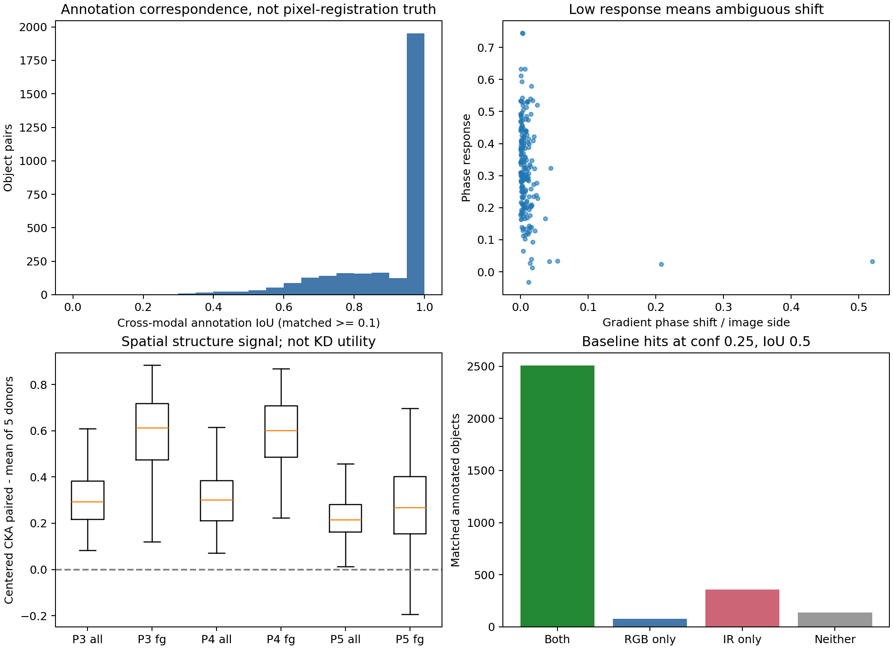

### 固定亮度分位 10%：ID 01250

RGB平均灰度约14.2/255。这里的亮度分位是本次样本描述，不是官方昼夜类别。

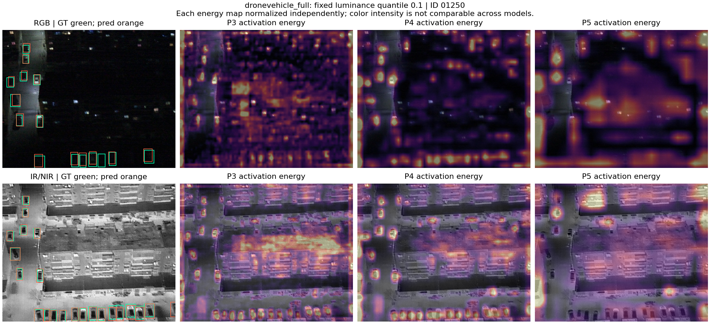

### 固定亮度分位 35%：ID 01021

RGB平均灰度约60.1/255。这里的亮度分位是本次样本描述，不是官方昼夜类别。

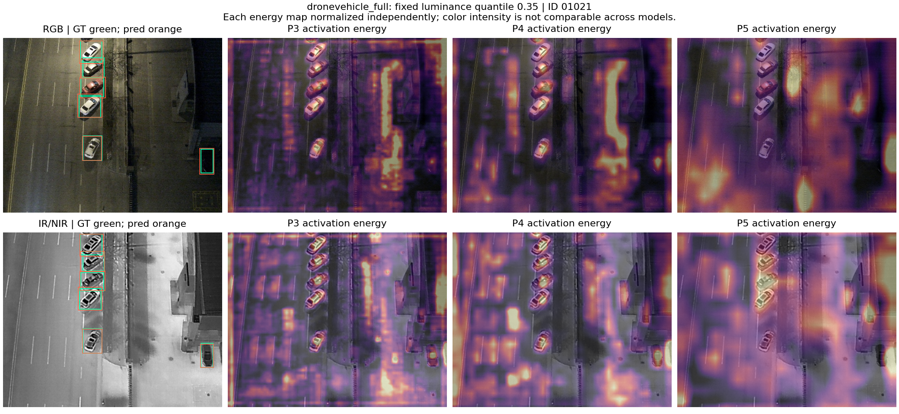

### 固定亮度分位 65%：ID 00654

RGB平均灰度约122.9/255。这里的亮度分位是本次样本描述，不是官方昼夜类别。

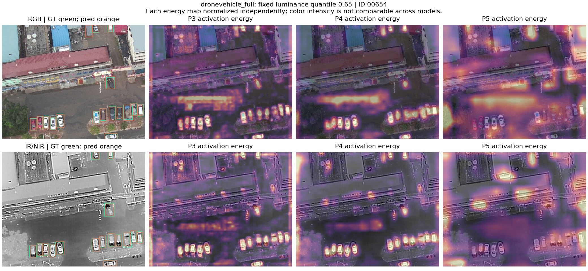

### 固定亮度分位 90%：ID 00300

RGB平均灰度约141.9/255。这里的亮度分位是本次样本描述，不是官方昼夜类别。

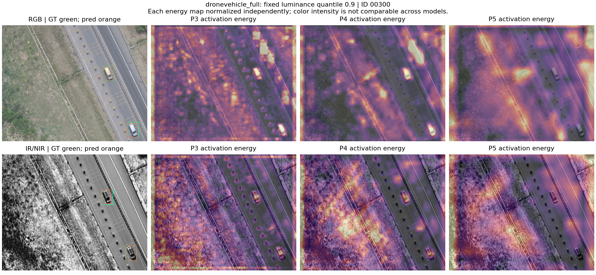

## LLVIP：RGB–热红外行人

低亮度120234中，IR行人轮廓更清楚；RGB在图像左上背景处出现未被GT支持的预测。高亮度250215中RGB检测目标，而IR在展示阈值下没有对应预测，说明总体更强的教师也有局部失败。绿色框相同来自共享标注。

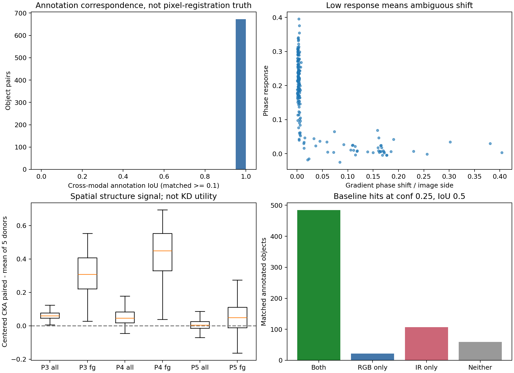

### 固定亮度分位 10%：ID 120234

RGB平均灰度约20.6/255。这里的亮度分位是本次样本描述，不是官方昼夜类别。

### 固定亮度分位 35%：ID 010071

RGB平均灰度约31.8/255。这里的亮度分位是本次样本描述，不是官方昼夜类别。

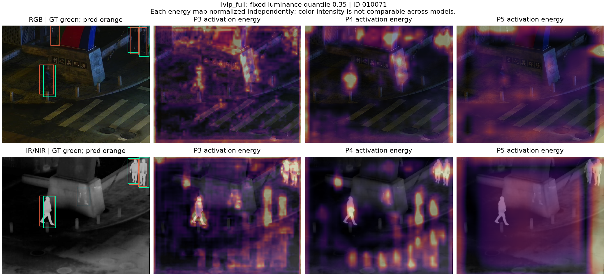

### 固定亮度分位 65%：ID 070055

RGB平均灰度约47.5/255。这里的亮度分位是本次样本描述，不是官方昼夜类别。

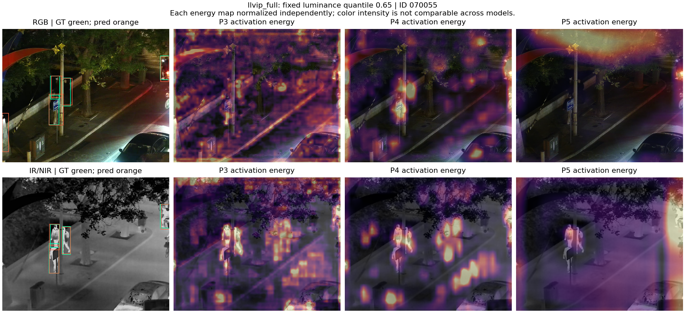

### 固定亮度分位 90%：ID 250215

RGB平均灰度约118.8/255。这里的亮度分位是本次样本描述，不是官方昼夜类别。

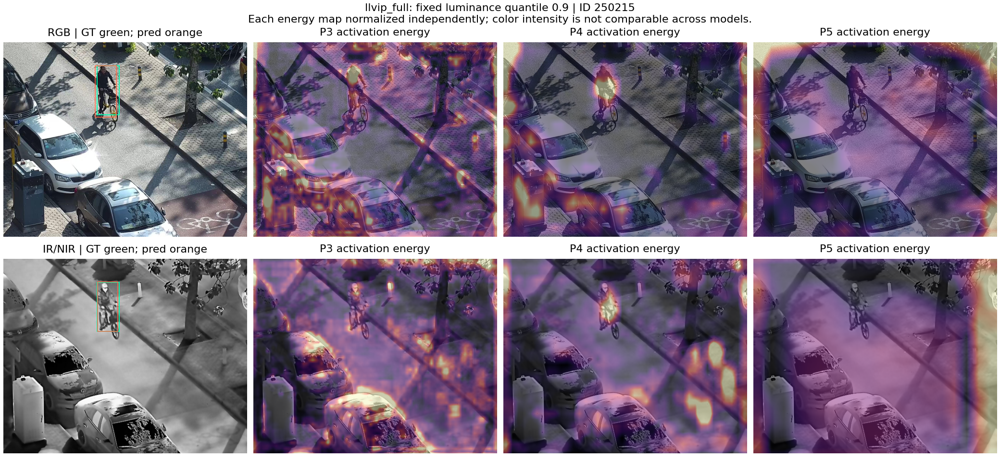

## VEDAI：RGB–近红外航拍小目标

小车在P3/P4形成局部响应，P5图面更多体现宽范围响应和边界。这里的灰度模态是近红外。不能把P5前景CKA的单个有效样本当作层级优劣结论。

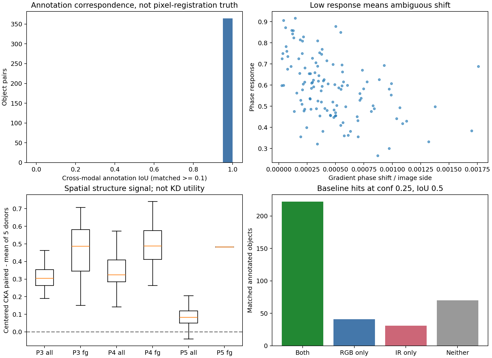

### 固定亮度分位 10%：ID 00000383

RGB平均灰度约97.8/255。这里的亮度分位是本次样本描述，不是官方昼夜类别。

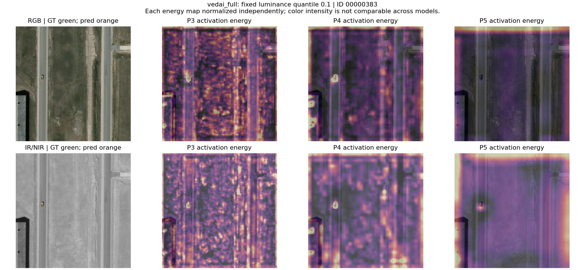

### 固定亮度分位 35%：ID 00000715

RGB平均灰度约112.4/255。这里的亮度分位是本次样本描述，不是官方昼夜类别。

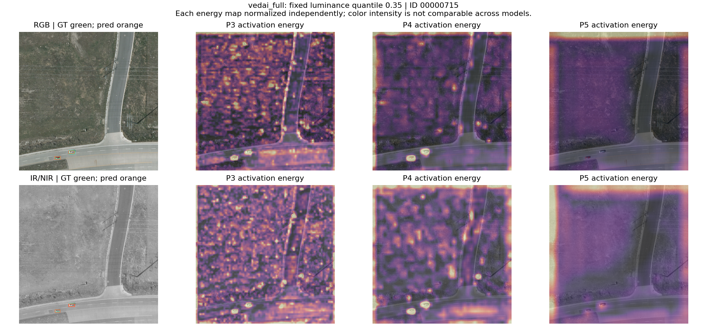

### 固定亮度分位 65%：ID 00001094

RGB平均灰度约132.9/255。这里的亮度分位是本次样本描述，不是官方昼夜类别。

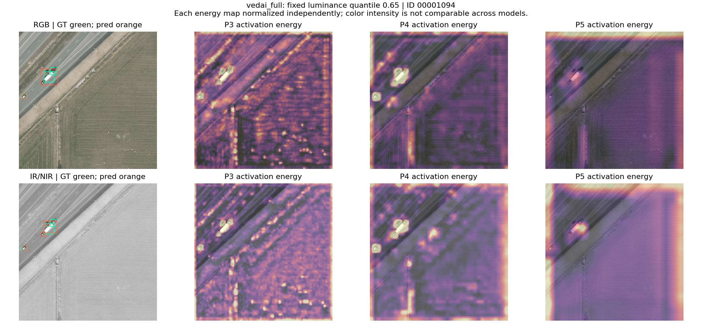

### 固定亮度分位 90%：ID 00000095

RGB平均灰度约150.9/255。这里的亮度分位是本次样本描述，不是官方昼夜类别。

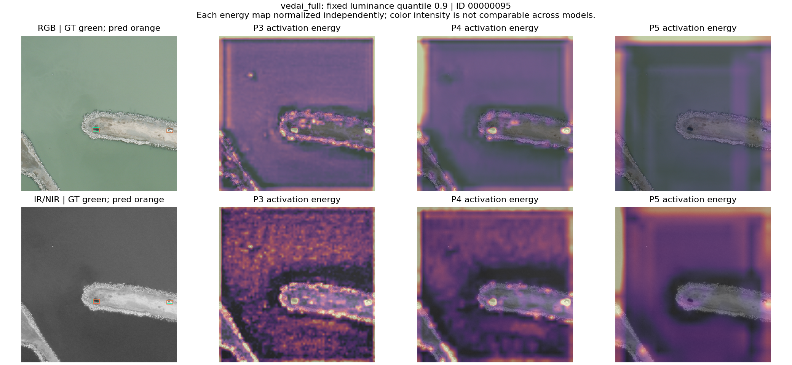

## 配准图与详细统计

独立配准/局部边缘图如下；低响应phase shift不能当成真实位移，共享标签IoU=1不能证明精确配准。三组局部窗口都按固定规则选择，没有应用估计配准。

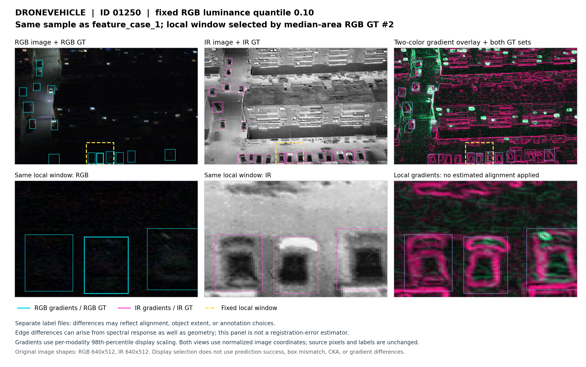

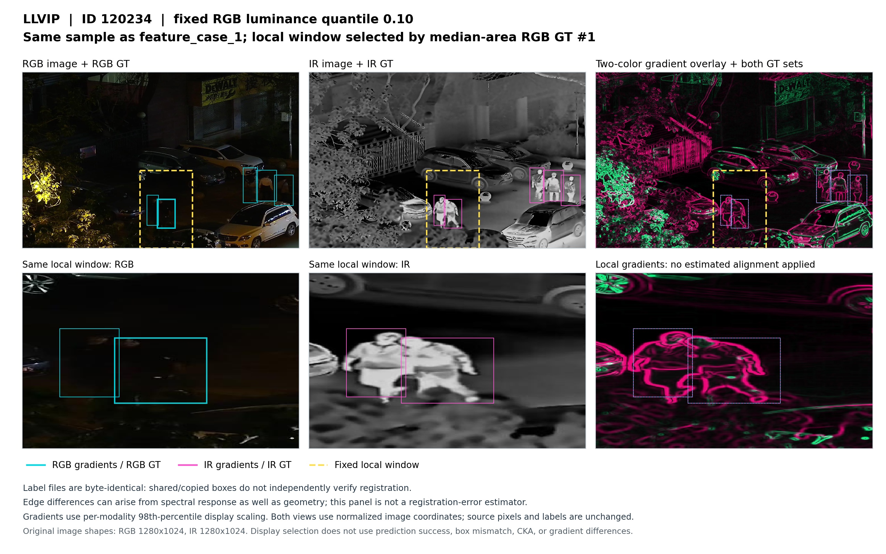

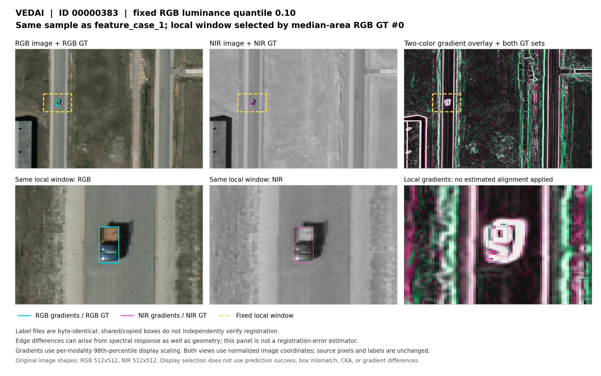

[完整研究诊断](../../07_研究分析/RGBIR数据特性与蒸馏方向诊断_20260906.md) · [逐目标与候选复算](probe_analysis.json) · [模型与数据身份](dataset_model_inventory.md)
