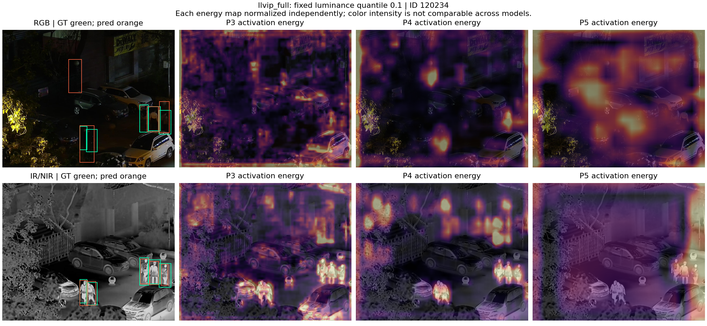
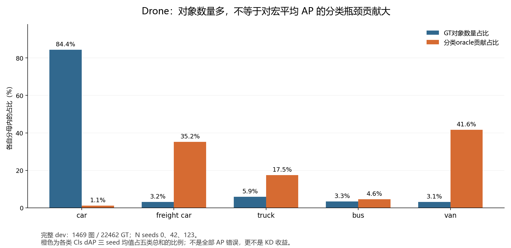

# RGB–IR 数据分析综合复盘（2026-09-07）

**现有证据支持优先验证LLVIP的条件定位，以及Drone少数类上的判别信息迁移；没有证明某种蒸馏载体已经取得最大训练收益。** 本报告把历次真实分析串联，区分样本、指标、模型身份与结论修正，不启动新训练，不改变C1/L1或原始结果。

我们的分析逐步回答四件事：两模态中的对象是否对应；教师在哪项任务上比RGB参考更有用；额外信息能否从输出或特征中读出；正式训练流能覆盖多少符合条件的对象。推理可以回答前三项的一部分，并检查第四项的候选覆盖；最终单模态学生能学到多少仍须KD训练和对照。

**1．先把各轮分析的身份分开。**

|阶段|真实范围与模型|主要测量|证据用途|
|---|---|---|---|
|9月5日历史审计|既有多项目结果和旧探针|配置、指标、模型身份、配对归因|排除错误参照和过强结论，不能拿旧错误FFT/CKA推断SAR无空间|
|9月6日第一轮RGBIR普查|Drone200dev、LLVIP200dev、VEDAI121val，共521对；各自两模态旧seed42/E200 baseline|配对标签、几何代理、P3/P4/P5热图和中心化CKA、固定阈值命中互补|寻找对象、条件和层级的候选方向|
|9月7日定位再分析|复用上述Drone/LLVIP200dev预测|同一对象本模态IoU与RGB坐标IoU、候选存在性及唯一归属|检验能否直接搬运教师定位|
|9月7日raw输出与特征探针|两数据集各1024train+200dev，共2448对；Drone新N42/旧IR42/新RGB N0，LLVIP旧RGB42/IR42|P3/P4类别logits、同anchor的4×16 DFL、局部特征、固定读出器和对照|比较教师内容质量与条件可读出信息|
|随后完整dev AP诊断|Drone同协议N/C0各三seed，1469图/22462GT；LLVIP旧RGB/IR42各2406图/7879GT|完整低阈值预测的AP错误分解、逐类oracle、对象桥接|区分对象计数和宏AP瓶颈|
|定位压力及实际训练流|静态候选25条件压力；两数据集各64×32自然训练图|目标分布位移敏感性、真实选择器过滤链、图/类/来源覆盖|检查定位目标脆弱性与训练候选存在性|

这些轮次的图像可能重叠，不能把521、2448、全dev和自然流数量相加当唯一图像量。早期和后期即使都写“200dev”，GT数也不同：早期Drone3116/LLVIP672，raw探针3084/643；模型、抽样、后处理和对象规则不同。旧baseline普查用旧RGB模型；raw探针Drone使用新weight0；自然流按冻结方法调用旧RGB参考R。跨轮差值不是训练前后的变化。

**2．配对、标注一致性和物理配准，是三层不同问题。**

第一轮先核对文件、split、类序、图像大小、标签来源、checkpoint和训练配置，确保每个模型确实属于该数据集。Drone使用去白边后HBB协议；LLVIP使用grouped fit/dev；VEDAI只使用official_fold01配对模型，排除训练见过该val中95/121图的另一个paper80教师。

在样本层，用同类框一对一关联共同GT；在图像层，比较灰度梯度相关和phase平移代理，并生成双色边缘叠图与局部放大；在物理层，单独检查可辨认结构点。标签、预测框边界和自动相关性均不充当物理对应真值。

|第一轮配对统计|Drone|LLVIP|
|---|---:|---:|
|图像对|200|200|
|RGB/IR GT|3116/3276|672/672|
|同类共同GT（匹配IoU≥.1）|3083|672|
|对应标签IoU均值|.904|1.000|
|标签文件完全相同|38/200|200/200|
|对应标签IoU低于.5|83/3083|0/672|

Drone总体对象可关联，但局部标签/可见性/几何差异不能忽略。未配到的IR标签不等于IR额外看见的真实物体，里面也可能有漏标、分类或标注范围差异。LLVIP共享标签来源使IoU=1，不能据此证明RGB轮廓与IR逐像素一致。跨模态纹理不同也会让phase低响应，此时大估计位移不能直接当错配证据。

真实几何审计曾独立接受LLVIP050001的六个静态点，只覆盖一图局部区域。原图P95误差3.4947px，计入3px标点不确定度后，640输入P95约3.2474px；P3不能通过，P4还受目标短边、凸包和增强范围限制。后续24对试样（每数据集12对，独立复核5对）均UNKNOWN，没有新增接受。这是精确对应证据与覆盖不足，**不是数据集配准失败率，也不是定位蒸馏负结果**。

**3．热图和CKA回答“响应在哪、是否有对应结构”。**

第一轮实际提取检测头前P3/P4/P5原生网格特征，计算通道L2激活强度，并分别统计去除padding后的全图、前景和背景中心化CKA。每对真实样本与五个随机图像donor比较。图册按RGB亮度10%/35%/65%/90%分位固定选四例，不根据方法胜负挑图。

|真实配对CKA减随机donor平均CKA|Drone|LLVIP|
|---|---:|---:|
|P3全图|.308|.067|
|P3前景|.582|.306|
|P4全图|.317|.055|
|P4前景|.575|.428|

LLVIP的前景配对结构明显强于全图，支持围绕对象研究知识，而不是从整幅图的平均相似度下结论。热图也显示IR行人与RGB背景响应可明显不同。但高CKA可能反映共同结构或冗余，低CKA可能是互补或不可重建信息；二者都不能直接预测KD收益。每幅热图独立归一化，颜色不能跨模型当信息量或可靠性比较，也不是梯度因果归因。

此图只展示一个固定样本：RGB上方有未获GT支持的预测，IR行人轮廓和部分P3/P4响应更明显。IR背景同样有强激活，不能把整张教师热图复制视为已合理。P5目标token少，尤其VEDAI极小目标，不能凭少数有效图的高相似度选蒸馏层。

**4．对象错误互补：教师具体能补哪些错误，也会伤哪些对象。**

早期以conf≥.25、同类IoU≥.5、一对一匹配定义命中，并用各自模态GT统计共同对象。Drone共同3083对象中双方命中2505、仅IR命中360、仅RGB命中78；LLVIP共同672对象中分别484、107、22。教师总体更强，但RGB独有正确对象仍存在，因此不能默认教师所有输出都值得模仿。

亮度分桶提供了条件线索：Drone的360个IR独有命中中320个来自最暗四分位（50图）。最暗桶内IR独有率320/966=33.13%，其余桶约4.27%、1.29%、1.00%。这是图像亮度代理与对象计数，未控制来源场景，不是真实昼夜标签，也没有验证亮度路由效果。

后续raw探针将检测头输出与GT辅助关联，粗候选阈值conf≥.05、IoU≥.1；再拆分低置信、无粗候选、仅类别错、仅定位错等状态。正确要求conf≥.25、类别正确、RGB GT IoU≥.5；教师修复还要求配对标签可靠。互斥表先归低置信，因此“低置信”可能同时存在其他错误，重叠旗标另存。

|后续200dev对象统计|Drone|LLVIP|
|---|---:|---:|
|RGB GT|3084|643|
|RGB正确|2386|404|
|教师正确、RGB错误|461|146|
|上述修复中RGB低置信|351|90|
|上述修复中RGB无粗候选|73|29|
|上述修复中仅定位不足|8|27|
|以教师替换RGB时的潜在损伤|193|42|

Drone另有28个纯类别错误和1个类别/定位均错被教师修复。以上是候选替换机会，**不是实际KD修复或损伤数**。最终没检出也不代表网络无输出：阈值/NMS可能丢弃已有响应，稠密检测头仍有类别和DFL；有GT可建立训练关联。但没有可归属响应时，不能从教师正确推断RGB必能学到。

还加入了独立RGB N0，以区分跨模态线索和普通多模型互补。其全GT修复221、损伤192，但T需要IR标签配对，两者eligible集合不同，因此需在共同eligible集合内比较。共同eligible的2946 GT中，T修复461、N0修复209，共同修复175、T独有286、N0独有34。T独有中car232、freight8、truck28、bus5、van13；这仍不是纯类别修复，更不是跨模态训练收益。

**5．完整AP分析修正了“Drone主要只缺置信度”的解释。**

对象表按GT逐个计数，完整AP则把每类预测按分数排序，同时考虑误检、重复、漏检和位置质量，最后给各类别等权。只提高固定框的分数、而不改善排序，可能增加固定阈值召回，却不改善AP。

为此，对Drone N/C0各三个seed完整1469dev和LLVIP旧RGB/IR完整2406dev，保存conf=.001、NMS=.7、max_det300、FP32、多标签输出，包括空预测图。官方TIDE分别在IoU=.5/.75拆分Cls、Loc、Both、Dupe、Bkg、Miss。各项oracle利用GT单独纠正一种错误后重新评价：dAP=oracle后AP−原AP。

|完整dev、六类main error内部|主要观察（pp）|
|---|---|
|Drone N，AP50|Cls 10.3597±.2579；Loc1.7207，Bkg1.4130|
|Drone N，AP75|Loc14.6821±.1116，Cls6.2186|
|LLVIP旧RGB，AP50|Loc8.7540，Miss7.6850，Bkg5.5340|
|LLVIP旧RGB，AP75|Loc56.3731|
|LLVIP旧IR，AP75|Loc仍有51.8923|

“最大”只限六类main error，另有更宽的special FP/FN，例如Drone AP50 FP oracle17.0420pp。oracle不是IR能提供的信息，也不是可蒸馏收益上限，独立项不可相加。LLVIP仅person，Cls/Both结构性为零，不代表前景/背景判别没有问题。TIDE用分数优先匹配和101点AP，原pinned mAP的匹配/积分不同；正式方法增益仍用原pinned口径。

|Drone类别|完整dev GT|N/AP50该类Cls dAP三seed均值，pp|
|---|---:|---:|
|car|18965|.574264|
|freight car|710|18.211750|
|truck|1336|9.060852|
|bus|751|2.397714|
|van|700|21.553709|

car占GT84.43%；freight/truck/van合计只占GT12.23%，却占五类Cls dAP均值之和的94.26%。**94.26%只表示宏分类oracle的贡献份额，不是全部AP错误或错误对象的份额。** 早期“修复中351/461低置信”仍正确，但不能用它推断完整宏AP主要只有置信度瓶颈。

C0已完成三seed，正式mAP相对匹配N为+.266655±.144373pp。但TIDE AP50只1/3 seed提高，分类残余oracle三个seed均增；不能说C0已经稳定修复了类别混淆。反过来，残余oracle增大也不单独证明分类能力退化。固定.25背景数+3/+5/+46与背景AP50 oracle两降一升可以同时成立，计数不能直接替代排序/AP损伤结论。

**6．定位分析逐步从“框更准”走到“同anchor分布目标是否更好”。**

第一步先检查坐标语义。早期Drone双方命中对象中，教师相对自己的IR GT仅平均领先+.00790 IoU；原样搬到RGB坐标再对RGB GT评价，变为−.04564，64.39%的对象变差。按教师本模态更准筛出的241个探索候选，仍有30个搬到RGB后变差。故必须在RGB目标坐标判断教师质量，不能用IR自身准确替代它。

第二步直接读YOLO回归头的四边离散分布：同anchor、同stride、每边16个bin；以RGB GT构造两邻bin目标，测教师/参考到GT的CE，再比较教师KD与GT监督在raw DFL logits上的梯度方向。主表排除背景、未配对GT、无粗候选和超出未clamp支撑[0,14.99]的对象。

|同anchor的200dev条件统计|Drone|LLVIP|
|---|---:|---:|
|有效对象|2821|548|
|教师GT-DFL CE更低比例|39.06%|61.13%|
|教师−参考GT-DFL CE均值（负更好）|+.12561|−.15590|
|KD与GT局部梯度cosine为正|64.37%|79.20%|

LLVIP同时有更好的RGB坐标框IoU、DFL目标质量和局部方向线索；Drone不适合全对象照搬，但条件子集仍可研究。CE与cosine不是同一指标；教师更接近GT和某个方向与GT夹角小可以不完全一致。这里的梯度仅对每对象64维raw DFL logits，没经过检测头到共享参数的Jacobian，也没有批内汇总，不能当成真实骨干更新有益。

第三步检查目标脆弱性。对静态质量候选做0及±1/2/4px、八方向共25种DFL分布位移；固定对象和anchor，不重选有利样本。4px八方向都保留质量门的LLVIP34/61=55.74%，Drone9/47=19.15%；最坏方向平均教师IoU领先分别+.0970和−.0231。它支持先投入LLVIP，但这是概率质量重采样的合成压力测试，边界质量丢失和条件归一化会产生偏差，并非真实图像错位或物理配准鲁棒性试验。

**7．特征探针测到了可读出信息，也测到了分析器自身的限制。**

后续2448图导出31498条对象/背景记录（22262前景、9236背景），每行关联各模型层输出。P3/P4固定anchor邻域最多3×3格点汇聚2×2，每层固定随机投影128维；只在train标准化和拟合固定alpha=1的ridge，dev只评价。GT-ROI是另外的辅助读出，不能混合共同样本。背景窗排除双模态标注，但“未标注背景”不保证真实无物体。

分类探针用对象类别/背景作为目标，加入N自身、IR、独立RGB N0、打乱IR等特征，检查额外模态是否提供超出N输出/特征的信息。Drone前景macro recall只平均五个前景类别，不是AP。含N logits的P3/P4联合读出：N特征50.490%，N+IR特征57.050%，N+独立RGB特征58.091%。所以不能把维度增加的效果全归因于跨模态。

更关键的检查是：N logits的ridge只有19.947%，少数类几乎未被读出；同anchor的原生N检测头直接读出却有60.143%。这揭示固定线性读出器欠拟合/类别不平衡等限制，推翻“logits本身没有类别信息、feature更好”的解释。LLVIP仅窗口宽高和stride元数据已有95.354%准确率，接近N logits96.186%；较容易的背景窗带来混杂，不能用它证明真实误检减少。

定位读出则回归同一RGB GT四边距离，固定共同对象、无GT宽高输入。结果为：

|dev逐对象mean IoU|Drone|LLVIP|
|---|---:|---:|
|原生N DFL期望，不拟合|.848451|.726483|
|固定ridge：N DFL+N局部特征|.757384|.694536|
|再加IR局部特征|.763415|.712817|
|再加打乱IR特征|.756972|.693303|
|固定ridge：N DFL+T DFL|.771577|.732449|

IR局部特征确有条件定位增量；Drone加独立RGB特征为.760211，小于加IR的.763415。但特征路径未超过原生N DFL，同一固定读出中直接加入T DFL的表现也更好。读出函数、维度和正则并非天然公平，不能据此给所有KD载体排永久优劣。教师参与推理的组合读出不等于RGB-only学生能学会，GT辅助选anchor也使该IoU不能当完整检测性能。

分类shuffle是split内普通置换，允许少量固定点；定位ridge使用无自配双射。这些都是诊断对照，不等于正式shuffled训练臂。

**8．自然训练流检查：固定自然流中的待认证候选覆盖。**

固定诊断种子20260907，对每数据集读取原训练流64×32=2048源图，保留增强、顺序、worker种子和双标签，使用实际C选择器及冻结R/T的confidence-first L选择器。L的几何部分暂时全放行，只统计未认证机会，不做学生backward或训练。它不同于静态GT辅助最佳几何anchor，也不能把selected数当严格上界，因为几何筛选可以改变anchor。

|实际自然流|LLVIP|Drone|
|---|---:|---:|
|RGB GT|5201|30197|
|L基础对象|5033|21488|
|双方判别可靠后|4731|18614|
|再要求R定位不足（IoU<.70）|278|744|
|教师定位质量后|241|692|
|教师领先等门后待认证候选|207|602|
|占L基础对象|4.11%|2.80%|
|非空batch/唯一图像|62/187|63/268|

主要压缩发生在R定位不足门，但两边多数batch仍有候选；不能把定位阻塞简单归为“门太严、完全没对象”。也不能把非空批当有限非零共享梯度批，完整校准尚待执行。

Drone C0/C1实际选中7821个对象，其中car6935（88.67%），car在C基础集占85.61%；L候选中car561/602（93.19%）。这提示现行选择可能更多覆盖常见car，未充分覆盖宏AP中的少数类短板。但C1含非目标类项，计数不是损失/梯度份额；train窗口与dev总体不同，不能据此断言它就是小增益的原因。

来源集中也已报告：Drone L最大治理来源标签占60.47%，LLVIP16.43%。两边分组粒度不同，不能当相机组、标定组或场景独立性比较，也不能把集中度直接归因为门控。应在各自分组中进一步检查可迁移内容是否集中于有限条件。

**综合判断和下一步。**

- LLVIP优先定位：依据是完整AP缺口、教师RGB坐标/DFL质量、压力敏感性与自然流候选的合并证据。旧RGB/IR完整dev mAP32.8784/48.8529只是模态差距；IR自身也有定位缺口，不能把约16pp当KD目标。
- Drone优先少数类判别：完整AP分类问题与IR额外修复均存在，但教师也会损伤原本正确的少数类对象。应先看各类真实难例的IR/N0差异、分数排序及实际梯度份额，再冻结新的选择/内容假设；原C1不能中途改。
- 定位并非无效：当前是对象身份与可用坐标支持证据不足、真实共享梯度与训练收益未验收。先核LLVIP实际候选邻域和新N协议，再决定能否按L1进入校准及GT控制；若改变合同需独立版本，不能静默放宽门。
- 特征并非无信息：固定读出中有局部定位线索，但尚无证据证明比输出蒸馏更值得优先长训。更复杂载体应先超过合适输出读出和独立RGB控制，再看单模态学生是否能学到。
- 更早SAR“无空间”、特征CKA排名和固定教师“必然负迁移”的过强叙事不沿用。当前结论是RGBIR哪些任务更值得验证，不是已经证明RGBIR普遍比SAR更可蒸馏。

**复核入口与本次产物。**

原始分阶段入口：[9月6日综合诊断](../../07_研究分析/RGBIR数据特性与蒸馏方向诊断_20260906.md)、[定位坐标审计](../2026-09-07_audit_判别与定位蒸馏可行性/DATA_FEASIBILITY.md)、[raw输出与特征](../2026-09-07_probe_Baseline蒸馏机会重诊断/STAGE_REPORT.md)、[完整AP和自然流阶段](../2026-09-07_probe_双数据集证据优先推进/STAGE_REPORT.md)。这些入口保留真实运行、失败attempt、独立审阅和服务器路径。

本次仅从既有证据整理，不新增模型推理。六份小体积JSON按字节复制并验证，见visualization_attempt2/evidence_receipt.json；分类图、CSV和SVG从逐seed逐类原始oracle算出。三位既有协作者分别复核AP、特征/DFL、几何历史口径；这是综合材料的交叉核对，不另宣称新训练或新分析器验收。

制图首个脚本因人工抄录的过精确参考常量触发assert，尚未输出图；保留build_evidence.py及已复制source_snapshots。attempt2改为与原JSON的逐seed宏均值直接核验，输出到独立visualization_attempt2；原数组和科学结果未修改，没有新哈希、GPU任务或参数选择。
