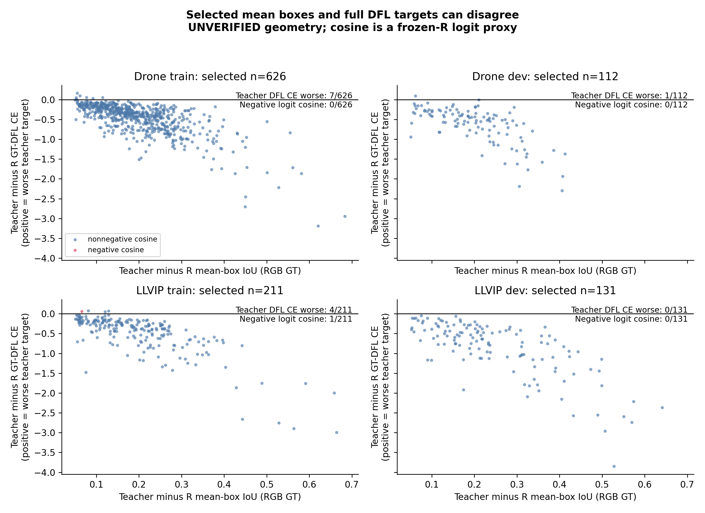

# D1/D2独立结果分析（2026-09-07 03:04终态）

> **定位信息存在，但训练集可选对象比例明显小于LLVIP开发集：未核验几何的D2在Drone/LLVIP train分别选中1.96%/3.77%的RGB GT；LLVIP dev为20.37%。这些统计不能授权L长训。唯一已接纳几何帧的两个GT均未被证据凸包完整覆盖，实际D2为0。**

## 证据与口径

读取全部四个完整诊断终态：每数据集固定train2048图、dev200图；另有LLVIP050001单帧verified合同诊断。仅在`summary.status=completed`且绑定`run_evidence.terminal_status=COMPLETED`后取数据。原始JSONL计数、对象身份、分组与bound summary全部独立复算一致，未使用中间progress作为结果。

数据为640居中letterbox、无训练随机增强、冻结T/R seed42、FP32前向、原始pre-NMS输出；不等同正式学生训练过程。亮度低/高按原PIL灰度均值78.283划分，仅代理；尺度用输入640后的面积阈值32²/96²。新roster与旧probe不同，不能把本表对象数与旧200图结果混用。

## 1. 总体机会与真实分母

| 数据集/划分 | 图数 | 总RGB GT | D1对象机会 | D2基础E | D2选中 | 选中/总GT | 选中/E |
|---|---:|---:|---:|---:|---:|---:|---:|
| Drone train | 2048 | 31931 | 259（0.81%） | 23511 | 626 | **1.96%** | 2.66% |
| Drone dev | 200 | 3084 | 58（1.88%） | 2177 | 112 | **3.63%** | 5.14% |
| LLVIP train | 2048 | 5592 | 75（1.34%） | 5492 | 211 | **3.77%** | 3.84% |
| LLVIP dev | 200 | 643 | 89（13.84%） | 559 | 131 | **20.37%** | 23.43% |
| LLVIP verified帧 | 1 | 2 | 0 | 0 | 0 | 0% | 未定义，分母0 |

上四行geometry均为`UNVERIFIED_DIAGNOSTIC`；geometry检查相当于全通过的诊断假设，**不能称为真实配准后可蒸馏比例**。聚合selected/E也不是训练loss的实际平均剂量：正式训练还有随机增强、逐batch分母和真实geometry mask。

LLVIP train→dev的差距有实质意义。R在训练图上看到的数据、分组划分和目标难度都可能导致差异，目前不能区分各自贡献。训练集只有117/5592个D1 localization_gap对象（2.09%），开发集162/643（25.19%）；不能用dev约20%的D2机会预计训练监督量。

## 2. 哪些条件过滤最多

每列都是同一批RGB GT的对象计数；D2每对象至多预选一个anchor。

| 累计条件 | Drone train | Drone dev | LLVIP train | LLVIP dev |
|---|---:|---:|---:|---:|
| RGB GT | 31931 | 3084 | 5592 | 643 |
| 同类GT一对一IoU≥.5 | 30765 | 2946 | 5592 | 643 |
| 配对GT IoU≥.8 | 24475 | 2358 | 5592 | 643 |
| 几何（本表未核验，全通过） | 24475 | 2358 | 5592 | 643 |
| 内部anchor及未clamp DFL合法支撑 | 24475 | 2358 | 5592 | 643 |
| 全RGB GT下唯一native几何归属 | 24406 | 2348 | 5582 | 641 |
| R粗候选/基础E | 23511 | 2177 | 5492 | 559 |
| R类别与置信度可靠 | 22300 | 1981 | 5400 | 527 |
| T也可靠 | 20866 | 1787 | 5260 | 475 |
| R IoU<.70 | 786 | 175 | 290 | 192 |
| T对RGB GT IoU≥.60 | 719 | 141 | 258 | 151 |
| T对IR GT IoU≥.50 | 719 | 141 | 258 | 151 |
| T−R IoU>.05（最终） | 626 | 112 | 211 | 131 |

Drone有明显标签对应筛损；LLVIP复制/共享标注导致label IoU条件基本全过，不能以此证明独立几何。两数据集train最大的收缩均发生在R已可靠之后的`R IoU<.70`，而不是DFL支撑范围。该结论只针对当前冻结R和letterbox probe。

## 3. D1和D2并非上下游嵌套集合

D1按空间匹配选择对象预测，D2在合法基础集合中按冻结R confidence优先挑实际anchor；两者的预测不是同一个。因此D2 selected大于D1 opportunity合理，不能把D1数当作D2上限。

| 划分 | D1∩D2 | 仅D1 | 仅D2 | D2对象的D1 low_confidence | D2对象的D1 well_localized |
|---|---:|---:|---:|---:|---:|
| Drone train | 199 | 60 | 427 | 248/626 | 159/626 |
| Drone dev | 42 | 16 | 70 | 38/112 | 29/112 |
| LLVIP train | 60 | 15 | 151 | 103/211 | 35/211 |
| LLVIP dev | 69 | 20 | 62 | 37/131 | 15/131 |

这进一步要求准确描述方法：**D2是“R预选anchor定位不足”，不是“该对象所有检测都定位不足”，也不是“当前动态学生已检出但不准”。** 一部分对象已经有另一处好的预测；L是否能改善最终检测仍由CL/CGT训练验证。

## 4. 类别、尺度、亮度、来源差异

以下百分比均除以对应分组的RGB GT；完整包含零计数组在`analysis_v1/group_comparison.csv`。

| 分组 | Drone train selected/GT | Drone dev selected/GT | LLVIP train selected/GT | LLVIP dev selected/GT |
|---|---:|---:|---:|---:|
| 低亮度代理 | 534/16698（3.20%） | 109/1586（6.87%） | 180/4949（3.64%） | 119/596（19.97%） |
| 高亮度代理 | 92/15233（0.60%） | 3/1498（0.20%） | 31/643（4.82%） | 12/47（25.53%） |
| small | 300/4801（6.25%） | 31/454（6.83%） | 3/28（10.71%） | 0/9 |
| medium | 325/26323（1.23%） | 81/2549（3.18%） | 202/5242（3.85%） | 130/617（21.07%） |
| large | 1/807（0.12%） | 0/81 | 6/322（1.86%） | 1/17（5.88%） |

Drone候选集中于暗图和小目标：small仅占GT约15%，却贡献300/626=47.92%的selected。train car贡献596/626=95.21%；其他类分别freight-car4、truck14、bus7、van5。因此平均结果可能主要由car驱动，不能称所有类别获益。LLVIP只有person一类；小目标样本28和9太少，不作稳健比例结论。

亮度规律不能机械跨数据集推广：LLVIP高亮度代理比例并不低于低亮度代理，且dev高亮度仅47个GT。此观察不支持把“夜间”直接设成统一L门。

来源方面，Drone train的B组贡献368/626，39_120m45_2贡献76、image组47、39_120m45_1贡献27；B组自身比例3.62%，两个39组约11.00%与12.44%，说明来源异质性。Drone dev的source metadata仅有`unavailable:val`，不能编造来源分层结论。LLVIP train最高计数prefix09/10各41、08为32、13为26；dev prefix12贡献42/131（该组42/109=38.53%）。来源组不是相机标定组；也不是可随意据结果扩展几何的许可。

## 5. 教师定位内容是否值得蒸馏

在实际selected anchor上，原生温度1的GT-DFL CE比较如下；ΔCE=T−R，负值代表教师分布对GT更好。

| 划分 | ΔCE均值 | ΔCE中位数 | 教师CE反而更差 | logit梯度cosine均值 | 负cosine |
|---|---:|---:|---:|---:|---:|
| Drone train | −0.4702 | −0.3685 | 7/626（1.12%） | 0.7636 | 0/626 |
| Drone dev | −0.6369 | −0.5156 | 1/112（0.89%） | 0.7559 | 0/112 |
| LLVIP train | −0.5052 | −0.3533 | 4/211（1.90%） | 0.7435 | 1/211 |
| LLVIP dev | −0.8615 | −0.6685 | 0/131 | 0.7876 | 0/131 |

大部分selected教师分布也具有更小GT-DFL CE，**当前数据支持进一步验证教师定位内容，并没有显示大量“均值框更好但DFL分布普遍有害”**。但仍存在少数均值框更好、DFL CE更差的对象，因此两个质量概念不能视为数学等价。

cosine使用冻结R的logits，比较GT-DFL与温度2教师KL的局部logit梯度；它不是动态学生的共享骨干参数梯度，也未包含原生IoU、类别loss、优化器、标签误差或物理错配，不能称“已经避免负迁移”。GT重监督control仍必需：这些代理不能证明教师比额外GT训练更有价值。

## 6. 唯一verified帧为什么仍是0

050001有2个RGB GT、D1均well_localized；但P3/stride8与P4/stride16的两对象几何检查都返回`uncovered_region`。CPU独立重查表明，其完整对象框不在已接纳六物理点的共同凸包内，因此geometry_count/base/selected全为0。理由记录于`analysis_v1/verified_frame_geometry_reasons.json`。不是把无候选/分母0当成方法失败，也不是声称整套LLVIP不配准。

不能用上表未核验geometry的211或131个对象替换这次实际0；也不能仅靠教师框/GT框高IoU扩展凸包。当前未满足L长训的几何覆盖条件。

## 可直接用于下一步的结论

1. 当前实际anchor统计支持“存在有用定位内容”，尤其LLVIP dev；但正式训练用train覆盖率与真实geometry mask核算，不能以dev占比预期收益。
2. 首轮CL/CGT设计仍能回答教师内容与GT重复监督之别；本诊断不构成其效果证据，也不据本批结果修改冻结阈值。
3. 现有已接受几何区域没有eligible对象。应如实记录这条证据线的限制，继续已有C/N/random与可解释控制；不以伪geometry放行L。

## 下载、压缩与复算

所有run分别存`drone_train/`、`drone_val/`、`llvip_train/`、`llvip_val/`、`llvip_verified_train/`。原始summary、roster、配置、bound receipt与小源码均保存。Drone两个大JSONL在root明确批准后完整原字节取回。

15份D1/D2/images JSONL原文共102,254,198字节；94在新`evidence_compressed_v1/`生成gzip，共12,890,622字节。服务器和本地都直接验证解压bytes==原bytes，没有哈希、没有改动或移动原件。GitHub上传`.jsonl.gz`和小产物，不上传巨型纯文本diff；本地原JSONL继续保留。

`analyze_diagnostics.py --output <新目录>`可从原JSONL或仅gzip自动复算全部统计与两张PNG/PDF。此轮CPU分析未运行模型或启动GPU；图已实际打开检查，轴、分母、未核验标识清楚。
